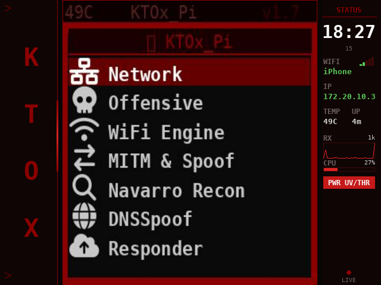
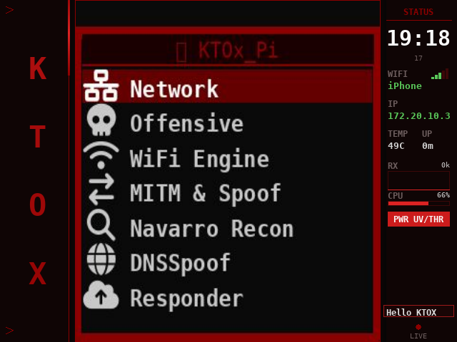
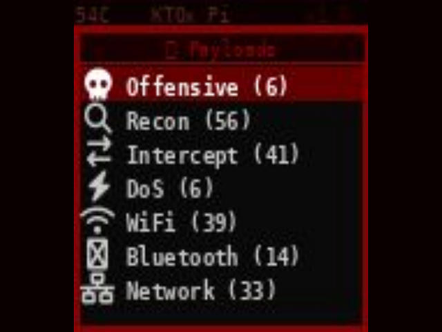
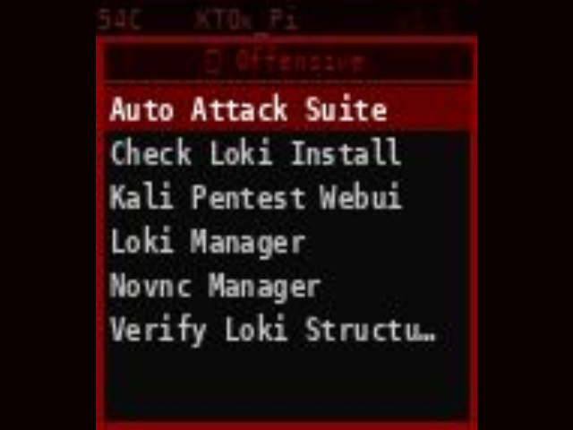
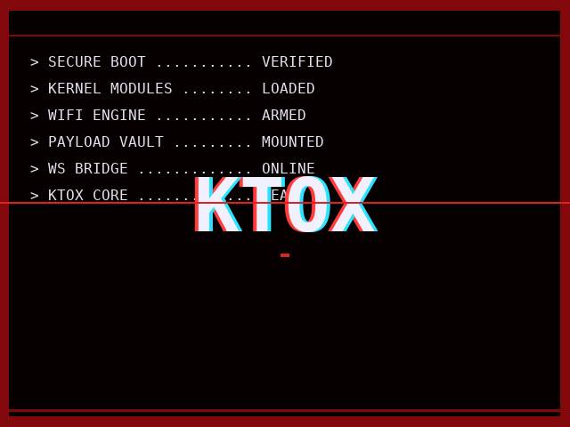

# KTOX_Pi · BigScreen Edition

**Raspberry Pi 3B+ (and up) · Waveshare Game HAT (480×320 HDMI + 12 GPIO buttons) · Debian / Raspberry Pi OS**

A port of [**wickednull**](https://github.com/wickednull)'s [KTOX_Pi](https://github.com/wickednull/KTOX_Pi) — the network-penetration & purple-team suite for the Pi Zero 2W + Waveshare 1.44" SPI LCD HAT — adapted to run on **bigger Pi boards with the Waveshare Game HAT** (HDMI panel + d-pad + ABXY + Start/Select + L/R buttons).

> All credit for the underlying suite, 364 payloads, KTOX TUI, WebUI, MITM/Responder/DNSSpoof modules, and overall design goes to **wickednull**. This fork only adds the hardware-port glue + a custom compositor UI for the larger panel.

The upstream README is preserved at [`README_upstream.md`](README_upstream.md).

---

## ▐ WHAT THIS PORT ADDS

KTOX_Pi was written for a Pi Zero 2W with a 128×128 SPI LCD and an 8-input layout (joystick + KEY1/2/3). The Game HAT we target has:

- 480×320 HDMI panel (driven via a 640×480 HDMI signal)
- 12 GPIO buttons (UP/DOWN/LEFT/RIGHT, A/B/X/Y, START/SELECT, L/R)
- HDMI audio (no SPI LCD, no joystick)

To run KTOX on this hardware without forking the upstream source, BigScreen Edition layers four files on top of stock KTOX_Pi:

| File | Role |
|------|------|
| `install-bigscreen.sh` | Safe-rewrite installer. Skips `dnsmasq` (which severs SSH if installed remotely), skips `autologin root tty1` (the labwc kiosk owns tty), installs to `/home/kali/KTOx` not `/root/`, only enables WS+WebUI as systemd, also generates a KTOX-branded Plymouth boot theme + KTOX swaybg wallpaper. |
| `ktox_bigscreen_runner.py` | Entry point. Monkey-patches `LCD_1in44` with a fake LCD that writes 320×320 PIL frames to `/dev/shm/ktox_last.jpg` (no SPI). Wraps `ImageDraw.Draw` + `ImageFont.truetype` so KTOX's 128-base coords + fonts render natively at 2.5× → sharp text on the larger panel without source patches. Overrides `ktox_device.PINS` with the Game HAT pin map. Replaces the duplicated in-frame top bar with a thin accent rule. Un-scales the on-screen `DarkSecKeyboard` while it runs so its layout doesn't overflow. |
| `ktox_hdmi_mirror.py` | Pygame fullscreen compositor. Plays a 10-second Arasaka-style boot splash (red sweep → corner HUD → typed boot log → KTOX chroma-aberration logo → tagline → flash transition, with an audio bleep + vertical scan beam at the reveal), then renders a designed UI filling the whole 480×320 panel: vertical KTOX brand sidebar on the left, KTOX content centered, live status sidebar on the right with clock, WiFi signal bars + SSID, IP, temp, uptime, RX sparkline, CPU mini-bar, pulsing under-voltage warning (only when the Pi is actually throttled), toast notifications, and an active-payload footer. |
| `launch-ktox.sh` | labwc autostart entry. Sets HDMI mode via `wlr-randr`, routes audio to the Game HAT speakers, pins pipewire quantum to 2048 (fixes Pi 3B+ audio crackle), then starts the mirror (kali, Wayland) + runner (root, for GPIO/raw sockets). |

## ▐ HARDWARE

| Component | Part | Notes |
|-----------|------|-------|
| SBC | Raspberry Pi 3B+ or newer | Pi 4 / Pi 5 also work; Zero 2W is too constrained for this canvas |
| Display + controls | Waveshare Game HAT | 480×320 IPS, d-pad + ABXY + Start/Select + L/R + speakers |
| WiFi adapter | Alfa AWUS036ACS (RTL8821AU) or similar | For monitor mode + injection (onboard radio is connectivity-only) |
| Ethernet (optional) | RJ45 onboard | For wired payloads |
| Power | 5.1 V / 3 A genuine PSU | The Pi 3B+ throttles hard on under-volt — the status panel flags it in red live |
| Storage | 32 GB+ microSD, Class 10 / A1 | |

## ▐ BUTTON MAPPING

Game HAT physical → KTOX logical:

| Game HAT | KTOX action | KTOX legacy name |
|----------|-------------|------------------|
| D-pad UP / DOWN / LEFT / RIGHT | Navigate | joystick |
| **A** | Select / OK | KEY_PRESS_PIN |
| **B** | Back | KEY1_PIN |
| **START** | Home | KEY2_PIN |
| **SELECT** | Stop / exit attack | KEY3_PIN |
| X, Y, L, R | (unmapped — reserved for future chord shortcuts) | — |

## ▐ INSTALL

Fresh Raspberry Pi OS (Debian bookworm or trixie) on a Pi 3B+, with the Game HAT seated. SSH in as your user (the installer expects `kali`; edit `KTOX_USER` / `KTOX_GROUP` near the top of `install-bigscreen.sh` if yours differs).

```bash
# 1. Clone this fork
git clone https://github.com/darkLabz001/KTOX_Pi-BigScreen-Edition.git
cd KTOX_Pi-BigScreen-Edition

# 2. Run the installer (does NOT auto-reboot)
sudo bash install-bigscreen.sh
```

The installer will:
1. Set boot GPIO pull-ups for all 12 Game HAT pins
2. `apt install` the KTOX deps (skipping `dnsmasq` — that one would sever SSH; install it locally when you're ready to lose the SSH connection)
3. Copy KTOX_Pi to `/home/kali/KTOx/` (owned by `kali`)
4. Symlink `/root/KTOx → /home/kali/KTOx` (KTOX has `/root/KTOx` hardcoded in many places — without this the Payloads menu shows "No payloads found")
5. Generate a KTOX-branded boot splash + install it as Plymouth theme + swaybg wallpaper
6. Enable the WS + WebUI systemd services (LCD UI is launched from labwc autostart instead)

After the installer finishes:

```bash
# 7. Drop in the runtime files
cp install-bigscreen.sh ktox_bigscreen_runner.py ktox_hdmi_mirror.py launch-ktox.sh /home/kali/KTOx/
chmod +x /home/kali/KTOx/launch-ktox.sh
mkdir -p /home/kali/KTOx/logs

# 8. Swap labwc autostart
mkdir -p ~/.config/labwc
cat > ~/.config/labwc/autostart <<'EOF'
$HOME/KTOx/launch-ktox.sh &
EOF

# 9. Reboot — KTOX takes over on next boot
sudo reboot
```

## ▐ SCREENSHOTS

### Home menu with live status sidebars


Left: vertical KTOX brand. Centre: untouched KTOX home menu rendered at 320×320 native (sharp text, not upscaled). Right: clock, WiFi signal bars + SSID, IP, temp, uptime, RX sparkline (5-min window), CPU mini-bar, under-voltage warning (pulsing red when `vcgencmd get_throttled` is non-zero), active-payload footer.

### Toast notification


Auto-fires on SSID change, IP change, payload start/stop. Externally injectable:
```bash
echo '{"text":"Custom message"}' >> /dev/shm/ktox_toasts.txt
```

### Payloads menu (21 categories, 364 scripts)


### Inside a category


### Arasaka boot splash mid-reveal


## ▐ WEBUI

The KTOX WebUI is bound to all interfaces on `:8080` and unchanged from upstream — load `http://<pi-ip>:8080` in any browser. WebSocket bridge on `:8765` is local-only. The token for the WebUI is in `/home/kali/KTOx/.webui_token` on the device.

## ▐ ROLLBACK

If something is wrong with the on-device UI, you can fall back to a blank labwc session (SSH still works) by SSH'ing in and:

```bash
touch ~/USE_NEOBOX     # only if you had the older NeoBoX firmware co-installed
sudo reboot
```

Or hard-disable the autostart entirely:
```bash
touch ~/KTOx/NOAUTOSTART
sudo reboot
```

The pygame mirror + KTOX runner will not start, but ssh, WS, WebUI all stay alive.

## ▐ LICENSE

Inherits the original KTOX_Pi [`LICENSE`](LICENSE) — see upstream [`wickednull/KTOX_Pi`](https://github.com/wickednull/KTOX_Pi).

## ▐ CREDITS

- **[wickednull](https://github.com/wickednull)** — original author of KTOX_Pi, KTOX TUI, the 364 payloads, WebUI, MITM / Responder / DNSSpoof / Purple Team modules. Everything in the Network Control Suite that does actual work.
- BigScreen Edition port — adapts upstream for Pi 3B+/Game HAT hardware with a custom pygame compositor UI.

> **Authorized eyes only.** Use only against networks and devices you own or have explicit permission to test.
